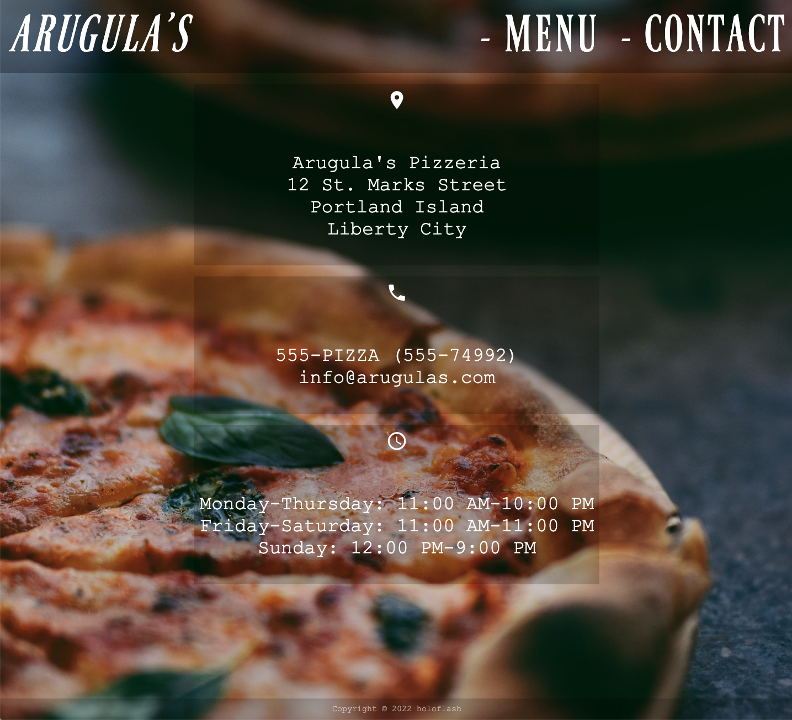

# Arugula's Restaurant Page

This is my Restaurant Page, made for The Odin Project course. It includes a header, footer, and three tabs: home, menu, and contact. When each tab is clicked, the corresponding page is displayed.

To do this, I imported several functions from separate JavaScript files.

I used an immediately invoked function expression to create the header and footer elements, as well as the logo, tabTwo, and tabThree elements, which were imported from home.js. I added event listeners to these elements to call the appropriate imported function when clicked. I created the cleanDOM function to remove the main content, which allows the imported functions to change the content of the website when called.

I used Google Material symbols for the icons on the website. These symbols were really easy to use and provide a consistent, modern look and feel.

This was my first time using webpack and I really enjoyed the benefits it offered. Webpack allowed me to bundle and transform my code, as well as manage my project assets such as images and stylesheets. It helped make my project more efficient, scalable, and maintainable. Overall, writing code in a modular way with webpack was a great experience.
